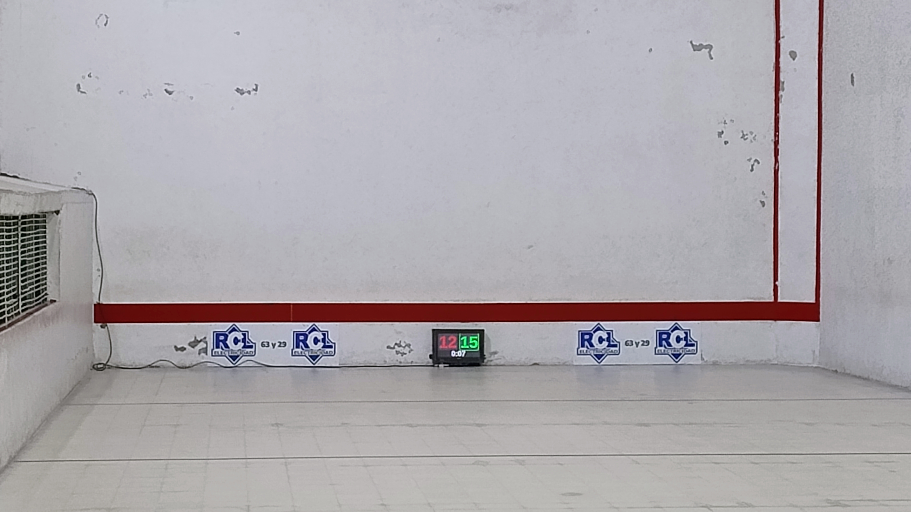

# Tanteador Universal

Proyecto de tanteador electrónico con interfaz gráfica PyQt5 y control remoto inalámbrico basado en ESP8266 (Wemos D1 Mini).

El tanteador fue donado para la cancha de Pelota Paleta del querido Club Uiniversal de La Plata.

Dejo aquí el código del proyecto para quien quiera replicarlo en otras canchas pelotaris ;)

## Características

- Interfaz gráfica a pantalla completa para marcador deportivo, con reloj y sonidos.
- Control remoto físico inalámbrico (ESP8266) para sumar/restar puntos y resetear.
- Temas visuales personalizables (digital, universal, dark, etc).
- Sonidos configurables para cada evento (subir/bajar/resetear puntos).
- Comunicación entre marcador y control remoto vía MQTT.
- Compatible con Linux (PyQt5, aplay, fuentes digitales).

## Estructura del proyecto

```
.
├── tanteador.py                 # Interfaz gráfica principal (PyQt5 + MQTT)
├── setup-ap.sh                  # Script para configurar AP WiFi
├── wifi-ap.service              # Servicio systemd para AP
├── esp8266/
│   └── tanteador_remoto_LOLIN/  # Firmware del control remoto (ESP8266)
│       └── tanteador_remoto_LOLIN.ino
├── fonts/                       # Fuentes digitales (DS-Digital, Dimitri, etc)
├── sonidos/                     # Sonidos por evento y tema
│   ├── descargar_sonidos.py     # Script para descargar/convertir sonidos
│   ├── digital/                 # Sonidos para tema digital
│   ├── digital-dark/            # Sonidos para tema digital oscuro
│   ├── universal/               # Sonidos para tema universal
│   └── universal-dark/          # Sonidos para tema universal oscuro
├── SDCARD/                      # Imágenes de SD (opcional)
```

## Requerimientos

Para el tablero: 

- Placa Raspberry Pi Zero 4Gb
- Monitor de 19'
- Parlantes usb
- Adaptardor mniHdmi-Hdmi y cable
- Bastidor de melaina y policarbonato compacto 10mm.

Para el control remoto:
- Placa ESP8266 (Wemos D1 Mini) (alternativa Node32)
- 3 Botones pulsadores
- 1 boton push con retencion
- Caja estanco


## Librerias

- Python 3.x
- PyQt5
- paho-mqtt
- aplay (Linux, para reproducir sonidos)
- Fuentes digitales instaladas en el sistema (DS-Digital, Dimitri, etc)
- Broker MQTT (ej: Mosquitto)

## Instalación

1. Instala dependencias en Linux:
   ```bash
   sudo apt install python3-pyqt5 python3-pip aplay fonts-ttf-ds-digital
   pip3 install paho-mqtt
   ```
   (Copia las fuentes de `fonts/` a tu sistema si es necesario)

2. Configura y ejecuta el broker MQTT (ejemplo con Mosquitto):
   ```bash
   sudo apt install mosquitto
   sudo systemctl enable --now mosquitto
   ```

3. Ejecuta el tanteador:
   ```bash
   python3 tanteador.py
   ```

4. Flashea el firmware en el ESP8266 (`esp8266/tanteador_remoto_LOLIN/tanteador_remoto_LOLIN.ino`) usando Arduino IDE o PlatformIO.
   - Configura el SSID y password WiFi en el código.
   - El control remoto se conecta automáticamente y publica eventos por MQTT.

## Uso

- Suma/resta puntos con los botones físicos del control remoto.
- Pulsación corta: suma punto. Pulsación larga: resta punto.
- Pulsación larga en botón RESET: reinicia el tanteador.
- Pulsación simultánea de ambos botones: cambia el tema visual.
- El tanteador reproduce sonidos y muestra el reloj desde el último reset.

## Créditos

- Proyecto y scripts: Diego Graselli (CHACA)
- Monitor donado por Carlos Aristegui
- Cables y protector de tension donado por Roberto Carlos Laguarta (RCL)

## Licencia

Este proyecto está licenciado bajo los términos de la licencia MIT. Consulta el archivo LICENSE para más detalles.

## Fotos

A continuación algunas imágenes del tanteador y su instalación:

<p align="center">
  
  
  
  
  
</p>

## Oros aspectos técnicos

Se utilizo un monitor de 19'

El bastidor fue realizado con melamina 18mm color negro.

12 cm fue la profundidad minima que pude lograr quitando la base del monitor.

El alto y ancho es 2cm por lado a partir de las medidas del monitor.

Para el frente se utilizo policarbonato compacto de 10mm, material resistente a impactos y 100% transparente.
(6mm es suficiente)

El policarbonato se atornillo con arandelas de goma por la parte posterior para mitigar el impacto de la pelota.
Tambien se puso goma entre el bastidor y el muro.


---

¡Contribuciones y mejoras son bienvenidas!
