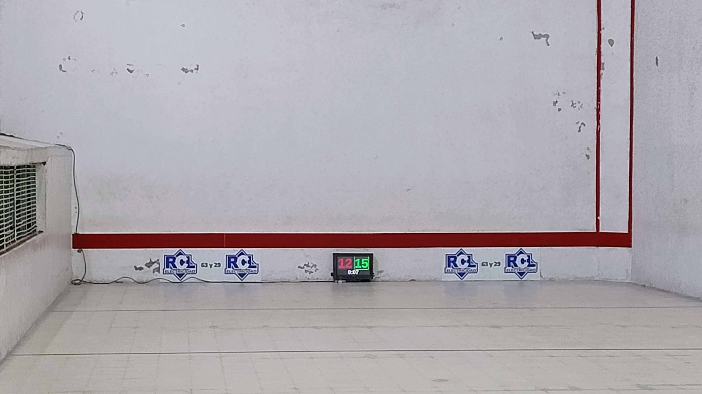

# Tanteador Universal

Proyecto de tanteador electrónico con interfaz gráfica PyQt5 y control remoto inalámbrico basado en ESP8266 (NodeMCU v3 LOLIN, CH340).

El tanteador fue donado para la cancha de Pelota Paleta del querido Club Uiniversal de La Plata.

<p align="center">
  
</p>

Dejo aquí el código del proyecto para quien quiera replicarlo en otras canchas pelotaris ;)

## Características

- Interfaz gráfica a pantalla completa para marcador deportivo, con reloj y sonidos.
- Control remoto físico inalámbrico (ESP8266) para sumar/restar puntos y resetear.
- Temas visuales personalizables (digital, universal, dark, etc).
- Sonidos configurables para cada evento (subir/bajar/resetear puntos).
- Comunicación entre marcador y control remoto vía MQTT.
- Compatible con Linux (PyQt5, aplay, fuentes digitales).

## Estructura del proyecto

```
.
├── tanteador.py                 # Interfaz gráfica principal (PyQt5 + MQTT)
├── tanteador.service            # Servicio systemd del marcador
├── splash.py                    # Cartel de arranque en letras grandes
├── splash.conf                  # Texto y colores del cartel
├── splash.service               # Servicio systemd del cartel
├── setup-splash.sh              # Silencia el log de arranque (una sola vez)
├── setup-pantalla.sh            # Fija la resolución del monitor (una sola vez)
├── setup-reloj.sh               # Activa el módulo de reloj DS3231 (una sola vez)
├── deploy.sh                    # Despliega a la Raspberry y reinicia el servicio
├── backup-firmware.sh           # Vuelca la flash del ESP antes de reflashear
├── medir-senal.sh               # Mide el RSSI del control a lo largo de la cancha
├── simular-control.sh           # Simula el control remoto por MQTT (pruebas locales)
├── ACTUALIZAR.md                # Cómo actualizar el sistema en el club
├── setup-ap.sh                  # Script para configurar AP WiFi (instalación inicial)
├── secrets.env.example          # Plantilla de credenciales del AP
├── wifi-ap.service              # Servicio systemd para AP
├── esp8266/
│   └── tanteador_remoto_LOLIN/  # Firmware del control remoto (ESP8266)
│       ├── tanteador_remoto_LOLIN.ino
│       └── credentials.h.example
├── fonts/                       # Fuentes digitales (DS-Digital, Dimitri, etc)
├── SDCARD/                      # Imágenes de SD (no versionadas)
```

Las credenciales reales (`secrets.env` y `esp8266/.../credentials.h`) no están
en el repo. Copiá los `.example` y completalos antes de instalar.

## Requerimientos

Para el tablero: 

- Placa Raspberry Pi Zero 4Gb
- Monitor de 19'
- Parlantes usb
- Adaptardor mniHdmi-Hdmi y cable
- Bastidor de melaina y policarbonato compacto 10mm.

Para el control remoto:
- Placa ESP8266 NodeMCU v3 LOLIN (CH340) (alternativa Node32)
- 3 Botones pulsadores
- 1 boton push con retencion
- Caja estanco


## Librerias

- Python 3.x
- PyQt5
- paho-mqtt
- aplay (Linux, para reproducir los beeps)
- Fuentes digitales instaladas en el sistema (DS-Digital, Dimitri, etc)
- Broker MQTT (ej: Mosquitto)

## Instalación

1. Instala dependencias en Linux:
   ```bash
   sudo apt install python3-pyqt5 python3-pip aplay fonts-ttf-ds-digital
   pip3 install paho-mqtt
   ```
   (Copia las fuentes de `fonts/` a tu sistema si es necesario)

2. Configura y ejecuta el broker MQTT (ejemplo con Mosquitto):
   ```bash
   sudo apt install mosquitto
   sudo systemctl enable --now mosquitto
   ```

3. Ejecuta el tanteador:
   ```bash
   python3 tanteador.py
   ```

4. Flashea el firmware en el ESP8266 (`esp8266/tanteador_remoto_LOLIN/tanteador_remoto_LOLIN.ino`) usando Arduino IDE o PlatformIO.
   - Copia `credentials.h.example` a `credentials.h` y completa SSID, password y `OTA_PASSWORD`.
   - La primera vez hay que flashear por USB; después se actualiza por WiFi (OTA).
   - El control remoto se conecta automáticamente y publica eventos por MQTT.

Para actualizar un tanteador ya instalado, ver [ACTUALIZAR.md](ACTUALIZAR.md).

## Uso

- Suma/resta puntos con los botones físicos del control remoto.
- Pulsación corta: suma punto. Pulsación larga: resta punto.
- Pulsación larga en botón RESET: reinicia el tanteador.
- Pulsación simultánea de ambos botones: cambia el tema visual.
- El tanteador emite un beep al anotar (el mismo para ambos equipos), dos beeps
  cortos al retroceder y uno grave al resetear. Los beeps se sintetizan en
  memoria: no hay archivos de sonido.
- Muestra el reloj desde el último reset.

## Chicharra de 12 V (opcional)

Los beeps salen por el parlante y, a la vez, por una chicharra de 12 V en
el pin `CHICHARRA_GPIO` de `tanteador.py` (18 por defecto, pin físico 12),
con el mismo ritmo. El pin queda activo aunque no haya nada conectado, así
que enchufar la chicharra no requiere tocar código. Con `None` queda solo
el parlante.

Hardware: buzzer piezoeléctrico de 12 V de **tono continuo** (~100 dB),
módulo MOSFET (IRF520 o similar) o módulo relé de 1 canal de 5 V, y una
fuente de 12 V ≥ 1 A.

Conexión con módulo MOSFET (GPIO 18 = pin físico 12):

```
Pi pin 12 (GPIO18) ──── SIG    del módulo MOSFET
Pi pin 6  (GND)    ──── GND    del módulo
Fuente 12V +       ──── VIN+   del módulo
Fuente 12V −       ──── VIN−   del módulo
Chicharra + / −    ──── V+ / V− del módulo
```

Con módulo relé: VCC al pin 2 (5 V), GND al pin 6, IN al pin 12 (GPIO18);
el 12 V+ de la fuente a COM, NO al + de la chicharra, y el − de la
chicharra al − de la fuente. Si la chicharra es electromagnética (bobina),
poné un diodo 1N4007 en paralelo con ella, en inversa (banda al +).

El control cableado puede llevar su propio buzzer de 12 V en la caja de los
botones, que suena con el mismo ritmo que la chicharra cuando el punto ya
está en pantalla: GPIO23 (pin físico 16) → módulo MOSFET optoacoplado → un
hilo blanco del UTP. Se prende con `BUZZER_CONTROL = True` en
`tanteador.py`. Compras y cableado en el anexo de `control-cableado.pdf`
(páginas 4 y 5).

## Confirmación en el control remoto

El tablero contesta cada toque del control wifi (tópico `ack`) recién cuando
el número ya está en pantalla. El control lo muestra así:

| Qué pasó | LED | Buzzer |
|---|---|---|
| Punto anotado | guiño (se apaga un instante) | un beep agudo |
| Resta / reset / tema | guiño | dos beeps cortos / uno largo grave / dos subiendo |
| Doble toque frenado por el tablero | nada | nada (el primero ya sonó) |
| No contó (sin señal, o llegó con más de 3 s de atraso) | parpadeo rápido | tres largos y graves, ~4 s después del toque |

Con el aviso de "no contó", hay que volver a apretar. El tablero nunca
suma dos veces el mismo toque, aunque el control lo reenvíe.

Buzzer en S3 (GPIO10), del lado izquierdo de la NodeMCU, **activo** o
**pasivo**: se elige con `BUZZER_ACTIVO` en el firmware. GPIO10 solo está
libre con el firmware grabado en modo de flash **DIO** (PlatformIO lo hace
así; en el Arduino IDE, Herramientas → Flash Mode: DIO). Si quedara en QIO,
el firmware lo detecta y deja el buzzer apagado en vez de colgarse. El activo suena siempre en el mismo tono y los sonidos se
distinguen por el ritmo; el pasivo (KY-006) además cambia de tono. Un
módulo activo de 3 pines (VCC, GND, I/O) ya trae transistor: VCC a VIN,
GND a G (los dos abajo a la izquierda), I/O a S3, sin nada más; si suena todo el tiempo y calla en los beeps,
es de los que se activan con LOW: `BUZZER_SUENA = LOW`. Un buzzer suelto
(2 patas) va como sigue. El ESP da 3,3 V y
pocos mA por pin: para que se oiga en la cancha, manejalo con un transistor
NPN (S8050, 2N2222) desde VIN (los 5 V del USB):

```
S3  ── 1 kΩ ── base       emisor ── G
VIN ── buzzer + ;  buzzer − ── colector
```

Si el buzzer es electromagnético (la mayoría de los KY-006), un diodo
1N4148 en paralelo con él, en inversa (banda a VIN). Para probar en la mesa
se puede conectar el S del módulo directo a S3, con una resistencia de
100 Ω en serie, pero suena bajo.

## Página de pruebas desde el celular

La Pi sirve dos páginas (conectado a la red `TNT`), pensadas para diagnosticar
sin notebook:

- `http://192.168.216.1` — pruebas del monitor: abrir el audio HDMI en
  silencio, sonar el beep de un punto sin sumar nada, y pulsar la chicharra
  sin audio.
- `http://192.168.216.1/senal` — señal del control remoto en vivo, la versión
  para celular de `medir-senal.sh`: caminás la cancha con el control y el
  celular, marcás cada punto desde la página (sin sumar tantos) y al final
  tenés peor/mejor/media por punto.

Las sirve `pruebas.py` (servicio `pruebas.service`), que se despliega con
`./deploy.sh` como todo lo demás.

Si el celular avisa "esta red no tiene internet", elegí mantener la conexión:
la página vive adentro de la red.

## Créditos

- Proyecto y scripts: Diego Graselli (CHACA)
- Monitor donado por Carlos Aristegui
- Cables y protector de tension donado por Roberto Carlos Laguarta (RCL)


## Licencia

Este proyecto está licenciado bajo los términos de la licencia MIT. Consulta el archivo LICENSE para más detalles.

Pegar el siguitente QR luego de utilizar, para que otras personas puedan copiarlo.
<p align="center">
  
</p>

## Fotos

A continuación algunas imágenes del tanteador y su instalación:

<p align="center">
  
  
  
  
  
</p>

## Oros aspectos técnicos

Se utilizo un monitor de 19'

El bastidor fue realizado con melamina 18mm color negro.

12 cm fue la profundidad minima que pude lograr quitando la base del monitor.

El alto y ancho es 2cm por lado a partir de las medidas del monitor.

Para el frente se utilizo policarbonato compacto de 10mm, material resistente a impactos y 100% transparente.
(6mm es suficiente)

El policarbonato se atornillo con arandelas de goma por la parte posterior para mitigar el impacto de la pelota.
Tambien se puso goma entre el bastidor y el muro.


---

¡Contribuciones y mejoras son bienvenidas!
